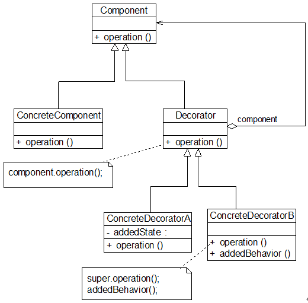

# designPattern-Study

## 目录
- 创建型
    - [简单工厂模式](#simpleFactory) &emsp; [demo](./simpleFactory.h)
    - [工厂模式](#factory) &emsp;&emsp;&emsp; [demo](./factory.h)
    - [抽象工厂模式](#abstract) &emsp; [demo](./abstractFactory.h)
- 结构型
    - [适配器模式](#adapter) &emsp; [demo](./adapter.h)
    - [桥接模式](#bridge) &emsp;&emsp; [demo](./bridge.h)
    - [组合模式](#composite) &emsp;&emsp; [demo](./composite.h)
    - [装饰模式](#decorator) &emsp;&emsp; [demo](./decorator.h)
    - [代理模式](#proxy) &emsp;&emsp; [demo](./proxy.h)
- 行为型
    - [命令模式](#command) &emsp;&emsp; [demo](./command.h)
    - [观察者模式](#observer) &emsp; [demo](./observer.h)
    - [策略模式](#strategy) &emsp;&emsp; [demo](./strategy.h)

## 简单工厂模式
| 简单工厂模式(Simple Factory Pattern)：定义一个工厂类，它可以根据参数的不同返回不同类的实例，被创建的实例通常都具有共同的父类。因为在简单工厂模式中用于创建实例的方法是静态(static)方法，因此简单工厂模式又被称为静态工厂方法(Static Factory Method)模式，它属于类创建型模式. |
|:-|

## 工厂模式
| 工厂方法模式(Factory Method Pattern)：定义一个用于创建对象的接口，让子类决定将哪一个类实例化。工厂方法模式让一个类的实例化延迟到其子类。工厂方法模式又简称为工厂模式(Factory Pattern)，又可称作虚拟构造器模式(Virtual Constructor Pattern)或多态工厂模式(Polymorphic Factory Pattern)。工厂方法模式是一种类创建型模式. |
|:-|

## 抽象工厂模式
| 抽象工厂模式(Abstract Factory Pattern)：提供一个创建一系列相关或相互依赖对象的接口，而无须指定它们具体的类。抽象工厂模式又称为Kit模式，它是一种对象创建型模式. |
|:-|

## 适配器模式
| 适配器模式(Adapter Pattern)：将一个接口转换成客户希望的另一个接口，使接口不兼容的那些类可以一起工作，其别名为包装器(Wrapper)。适配器模式既可以作为类结构型模式，也可以作为对象结构型模式. |
|:-|

## 桥接模式
| 桥接模式(Bridge Pattern)：将抽象部分与它的实现部分分离，使它们都可以独立地变化。它是一种对象结构型模式，又称为柄体(Handle and Body)模式或接口(Interface)模式. |
|:-|

## 组合模式
| 组合模式(Composite Pattern)：组合多个对象形成树形结构以表示具有“整体—部分”关系的层次结构。组合模式对单个对象（即叶子对象）和组合对象（即容器对象）的使用具有一致性，组合模式又可以称为“整体—部分”(Part-Whole)模式，它是一种对象结构型模式. |
|:-|

## 装饰模式
| 装饰模式(Decorator Pattern)：动态地给一个对象增加一些额外的职责，就增加对象功能来说，装饰模式比生成子类实现更为灵活。装饰模式是一种对象结构型模式. |
|:-|

## 代理模式
| 代理模式(Proxy Pattern)：给某一个对象提供一个代理或占位符，并由代理对象来控制对原对象的访问. |
|:-|

## 命令模式
| 命令模式(Command Pattern)：将一个请求封装为一个对象，从而让我们可用不同的请求对客户进行参数化；对请求排队或者记录请求日志，以及支持可撤销的操作。命令模式是一种对象行为型模式，其别名为动作(Action)模式或事务(Transaction)模式. |
|:-|

## 观察者模式
| 观察者模式(Observer Pattern)：定义对象之间的一种一对多依赖关系，使得每当一个对象状态发生改变时，其相关依赖对象皆得到通知并被自动更新。观察者模式的别名包括发布-订阅（Publish/Subscribe）模式、模型-视图（Model/View）模式、源-监听器（Source/Listener）模式或从属者（Dependents）模式。观察者模式是一种对象行为型模式. |
|:-|

## 策略模式
| 策略模式(Strategy Pattern)：定义一系列算法类，将每一个算法封装起来，并让它们可以相互替换，策略模式让算法独立于使用它的客户而变化，也称为政策模式(Policy)。策略模式是一种对象行为型模式. |
|:-|

## 参考
UML 图来自 [LoveLion](https://blog.csdn.net/LoveLion/article/details/17517213)